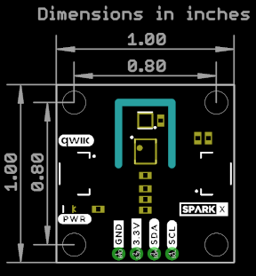

SparkX CO2 Sensor - STC31 (Qwiic)
========================================

[*SparkX CO2 Sensor - STC31 (Qwiic) (SPX-18385)*](https://www.sparkfun.com/products/18385)

Do you need to be able to sense CO2 concentrations of up to 100%? If so, the STC31 is the sensor for you!
The Sensirion STC31 thermal conductivity sensor has two CO2 measurement ranges: 0 to 25 vol%; and 0 to 100 vol%.
The measurement repeatability is 0.2 vol%, with a stability of 0.025 vol% / °C.
The measurement accuracy depends on the measurement range: 0.5 vol% + 3% measured value; 1 vol% + 3% measured value.

Our breakout includes a separate SHTC3 humidity and temperature sensor; allowing the STC31 to deliver humidity-compensated
measurements together with improved temperature compensation. The STC31 can compensate for atmospheric pressure too - which is handy if,
like us, you’re up in the mountains!

The STC3x sensor family is Sensirion’s series of Gas Concentration sensors designed for high-volume applications.
The STC3x utilizes a revolutionized thermal conductivity measurement principle, which results in superior repeatability and long-term stability.
This makes the STC31 a perfect choice for applications where reliability is key.

The outstanding performance of these sensors is based on Sensirion’s patented CMOSens® sensor technology, which combines the sensor element,
signal processing and digital calibration on a small CMOS chip.
The well-proven CMOS technology is perfectly suited for high-quality mass production and is the ideal choice for demanding and cost-sensitive OEM applications.

Repository Contents
-------------------
* **/Documents** - datasheets etc.
* **/Hardware** - Eagle design files (.brd, .sch)
- **LICENSE.md** contains the licence information

Documentation
--------------
* **[STC3x Arduino Library](https://github.com/sparkfun/SparkFun_STC3x_Arduino_Library)** - Arduino library for the SparkX CO2 Sensor - STC31.
* **[Hookup Guide]()** - Basic hookup guide for the SparkX CO2 Sensor - STC31.

Product Versions
----------------
* [SPX-18385](https://www.sparkfun.com/products/18385) - Original SparkX Release.

License Information
-------------------

This product is _**open source**_!

Please review the LICENSE.md file for license information.

If you have any questions or concerns on licensing, please contact technical support on our [SparkFun forums](https://forum.sparkfun.com/viewforum.php?f=123).

Distributed as-is; no warranty is given.

- Your friends at SparkFun.
